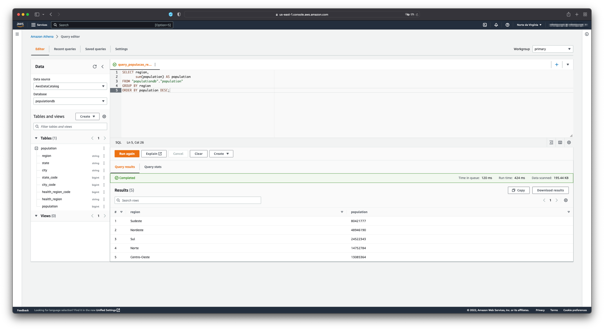

# Explorando o Athena e o Quicksight na AWS

Esse projeto prático é parte dos requisitos do Bootcamp em Ciência de Dados da DIO. A descrição original desta prática está <a href="https://github.com/cassianobrexbit/dio-live-athena">neste repositório</a>.

## Serviços utilizados
 - Amazon S3
 - Amazon Glue
 - Amazon Athena
 - Amazon QuickSight

## Etapas para desenvolvimento

### Criação de um bucket no Amazon S3

Criou-se um bucket na S3 com a seguinte estrutura de arquivos

    .    
    ├── population
    │   └── brazil_population_2019.csv
    │   
    └── output

A pasta population contém a base de dados que será analisada enquanto a pasta output armazenará as consultas SQL. 
    

### Criação do Glue Crawler

Nessa etapa foi criada um Crawler na Glue. Desta forma, foi possível identificar o esquema dos dados presentes do arquivo `brazil_population_2019.csv` presente na S3. Esse esquema identificado é apresentado a seguir.

### Realização de consultas SQL utilizando o Athena

Foram realizadas 4 consultas utilizando a linguagem SQL. Os comandos utilizados nessas consultas estão presentes neste repositório.

Os resultados obtidos são apresentados a seguir:

#### Consulta da população total da base de dados

#### Consulta da população de Belo Horizonte

#### Consulta da população das regiões brasileiras em ordem decrescente

#### Consulta das 5 cidades mais populosas

### Exportando consultas no S3
As consultas foram automaticamente salvas no bucket S3 conforme apresentado a seguir.

### Visualizar dados no Amazon QuickSight

Por fim, criou-se uma dashboard utilizando o QuickSight apresentando as informações da população estratificada por regiões, a lista das 10 cidades mais populosas e a quantidade de município em cada estado nos dados disponibilizados.

Esses indicadores foram selecionados com o intuito de realizar operações de combinações, filtro e agregação nos dados.

