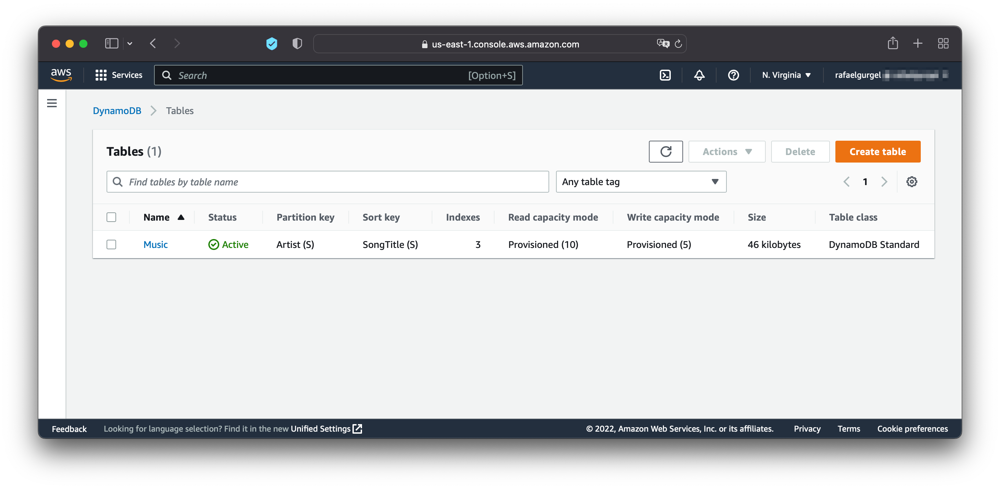
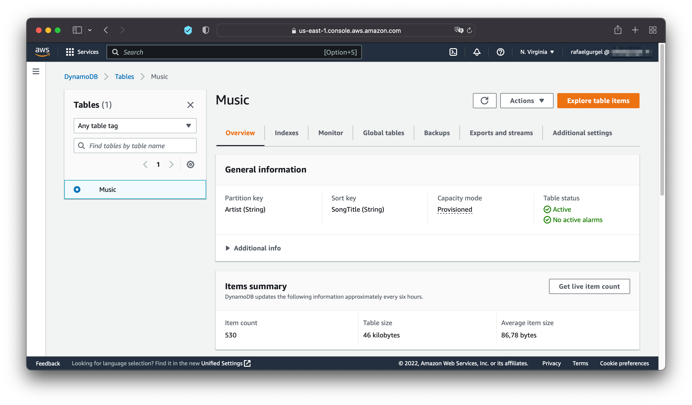
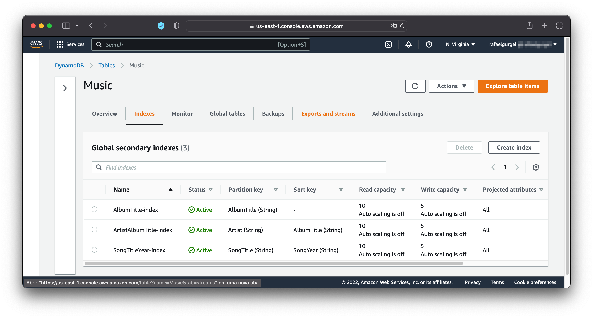
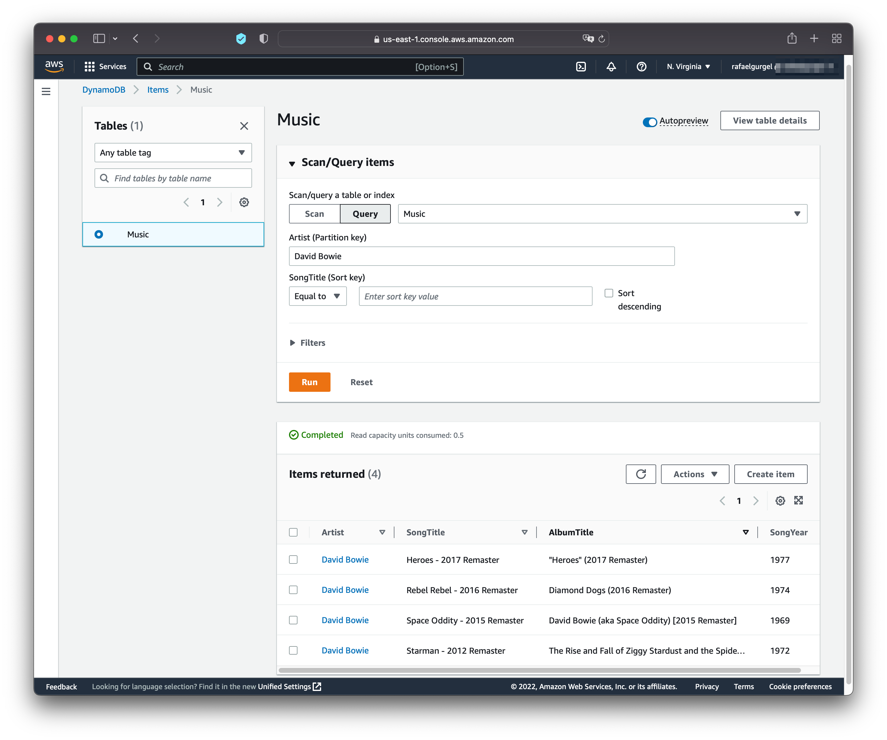
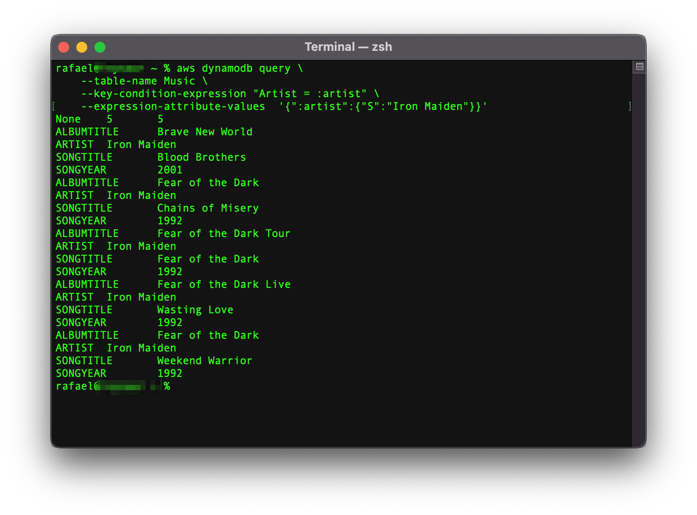
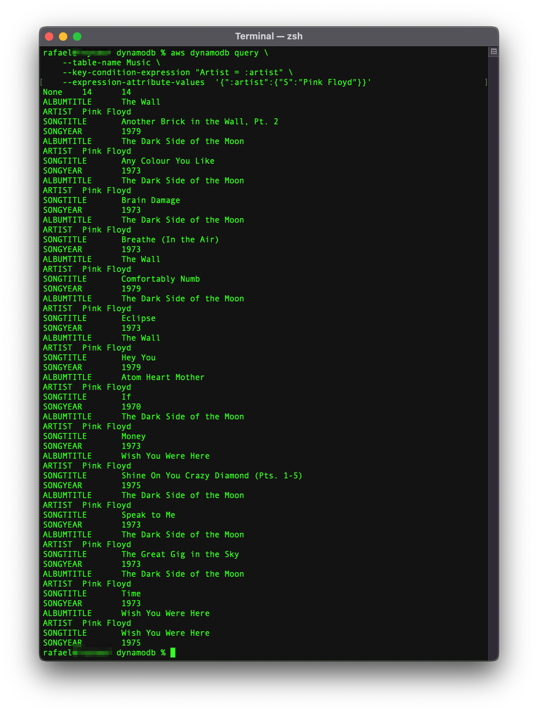
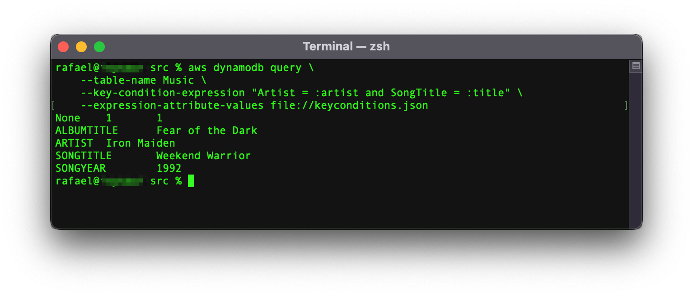
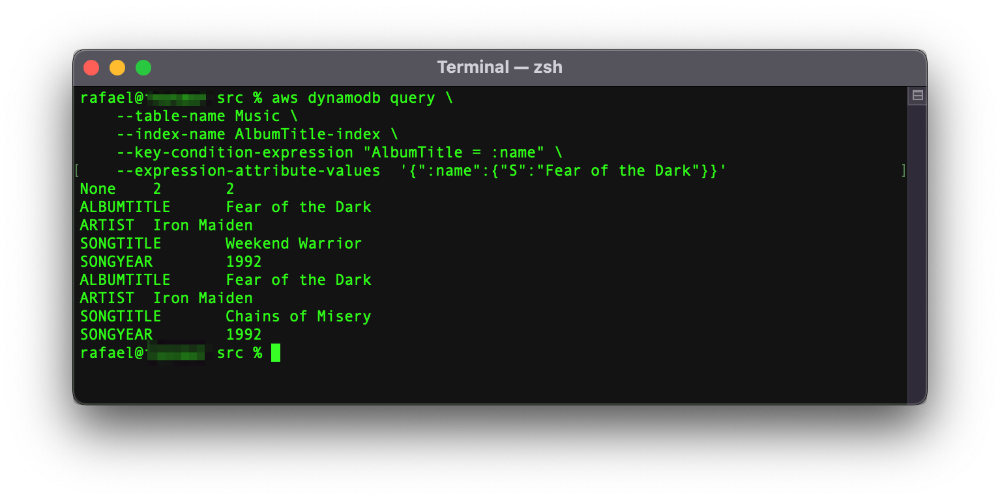
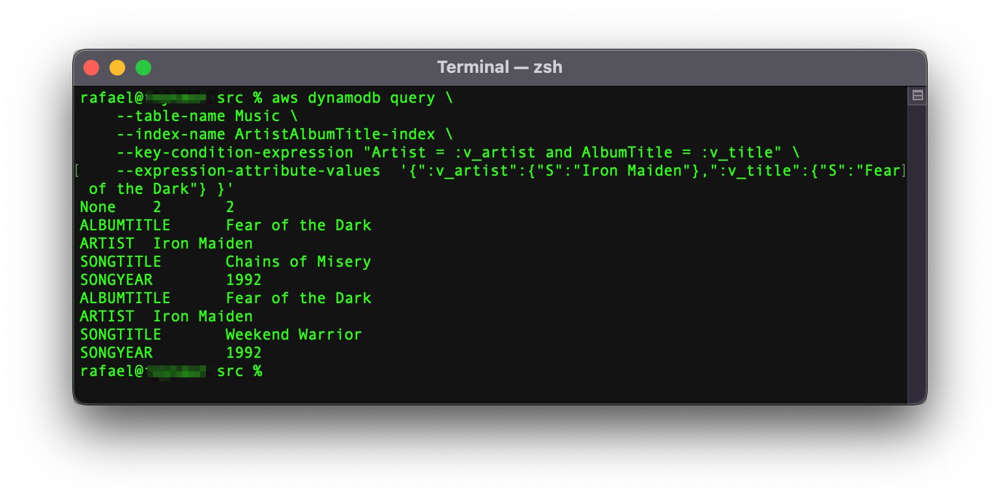

<h1>Criação e consultas em uma base de dados no DynamoDB</h1>

<p>Esse projeto foi originalmente proposto no aprofundamento em <i>cloud computing</i> do Bootcamp da <a href="https://dio.me">DIO</a>.</p>

<p>Nesse caso, criou-se um banco de dados na AWS com informações musicais conforme sugerido pelo instrutor
em seu <a href="https://github.com/cassianobrexbit/dio-live-dynamodb">repositório</a>.</p>

<p>Com o objetivo de ir além do projeto proposto, ampliou-se o número de dados inseridos. Sendo assim, inseriu-se 530 músicas conforme apresentado a seguir. Esses dados foram obtidos via raspagem de dados na web e automaticamente inseridos no DinamoDB via a CLI da AWS</p>

A seguir serão apresentados os comandos utilizados:

<h2> Comandos para construção do banco de dados</h2>


<h3> Criação da tabela</h3>

```
aws dynamodb create-table \
    --table-name Music \
    --attribute-definitions \
        AttributeName=Artist,AttributeType=S \
        AttributeName=SongTitle,AttributeType=S \
    --key-schema \
        AttributeName=Artist,KeyType=HASH \
        AttributeName=SongTitle,KeyType=RANGE \
    --provisioned-throughput \
        ReadCapacityUnits=10,WriteCapacityUnits=5
```




<h3>Inserção de item</h3>

<h4>Item único</h4>

```
aws dynamodb put-item \
    --table-name Music \
    --item file://itemmusic.json
```

<h4>Múltiplos Itens</h4>

```
aws dynamodb batch-write-item \
    --request-items file://batchmusic.json
```

No total foram inseridas 530 itens diferentes no banco de dados conforme apresentado a seguir.



<h3>Criação de Indexes</h3>

<h4>Index global secundário baeado no título do álbum</h4>

```
aws dynamodb update-table \
    --table-name Music \
    --attribute-definitions AttributeName=AlbumTitle,AttributeType=S \
    --global-secondary-index-updates \
        "[{\"Create\":{\"IndexName\": \"AlbumTitle-index\",\"KeySchema\":[{\"AttributeName\":\"AlbumTitle\",\"KeyType\":\"HASH\"}], \
        \"ProvisionedThroughput\": {\"ReadCapacityUnits\": 10, \"WriteCapacityUnits\": 5      },\"Projection\":{\"ProjectionType\":\"ALL\"}}}]"
```

<h4>Index global secundário baseado no nome do artista e no título do álbum</h4>

```
aws dynamodb update-table \
    --table-name Music \
    --attribute-definitions\
        AttributeName=Artist,AttributeType=S \
        AttributeName=AlbumTitle,AttributeType=S \
    --global-secondary-index-updates \
        "[{\"Create\":{\"IndexName\": \"ArtistAlbumTitle-index\",\"KeySchema\":[{\"AttributeName\":\"Artist\",\"KeyType\":\"HASH\"}, {\"AttributeName\":\"AlbumTitle\",\"KeyType\":\"RANGE\"}], \
        \"ProvisionedThroughput\": {\"ReadCapacityUnits\": 10, \"WriteCapacityUnits\": 5      },\"Projection\":{\"ProjectionType\":\"ALL\"}}}]"
```

<h4>Index global secundário baseado no título da música e no ano</h4>

```
aws dynamodb update-table \
    --table-name Music \
    --attribute-definitions\
        AttributeName=SongTitle,AttributeType=S \
        AttributeName=SongYear,AttributeType=S \
    --global-secondary-index-updates \
        "[{\"Create\":{\"IndexName\": \"SongTitleYear-index\",\"KeySchema\":[{\"AttributeName\":\"SongTitle\",\"KeyType\":\"HASH\"}, {\"AttributeName\":\"SongYear\",\"KeyType\":\"RANGE\"}], \
        \"ProvisionedThroughput\": {\"ReadCapacityUnits\": 10, \"WriteCapacityUnits\": 5      },\"Projection\":{\"ProjectionType\":\"ALL\"}}}]"
```




<h2>Consultas no banco de dados</h2>




<h3>Pesquisa de item por artista</h3>

```
aws dynamodb query \
    --table-name Music \
    --key-condition-expression "Artist = :artist" \
    --expression-attribute-values  '{":artist":{"S":"Iron Maiden"}}'
```




```
aws dynamodb query \
    --table-name Music \
    --key-condition-expression "Artist = :artist" \
    --expression-attribute-values  '{":artist":{"S":"Pink Floyd"}}'
```



<h3>Pesquisa de item por artista e título da música</h3>

```
aws dynamodb query \
    --table-name Music \
    --key-condition-expression "Artist = :artist and SongTitle = :title" \
    --expression-attribute-values file://keyconditions.json
```



<h3>Pesquisa pelo index secundário baseado no título do álbum</h3>

```
aws dynamodb query \
    --table-name Music \
    --index-name AlbumTitle-index \
    --key-condition-expression "AlbumTitle = :name" \
    --expression-attribute-values  '{":name":{"S":"Fear of the Dark"}}'
```


<h3>Pesquisa pelo index secundário baseado no nome do artista e no título do álbum</h3>

```
aws dynamodb query \
    --table-name Music \
    --index-name ArtistAlbumTitle-index \
    --key-condition-expression "Artist = :v_artist and AlbumTitle = :v_title" \
    --expression-attribute-values  '{":v_artist":{"S":"Iron Maiden"},":v_title":{"S":"Fear of the Dark"} }'
```


<h3>Pesquisa pelo index secundário baseado no título da música e no ano</h3>

```
aws dynamodb query \
    --table-name Music \
    --index-name SongTitleYear-index \
    --key-condition-expression "SongTitle = :v_song and SongYear = :v_year" \
    --expression-attribute-values  '{":v_song":{"S":"Wasting Love"},":v_year":{"S":"1992"} }'
```

