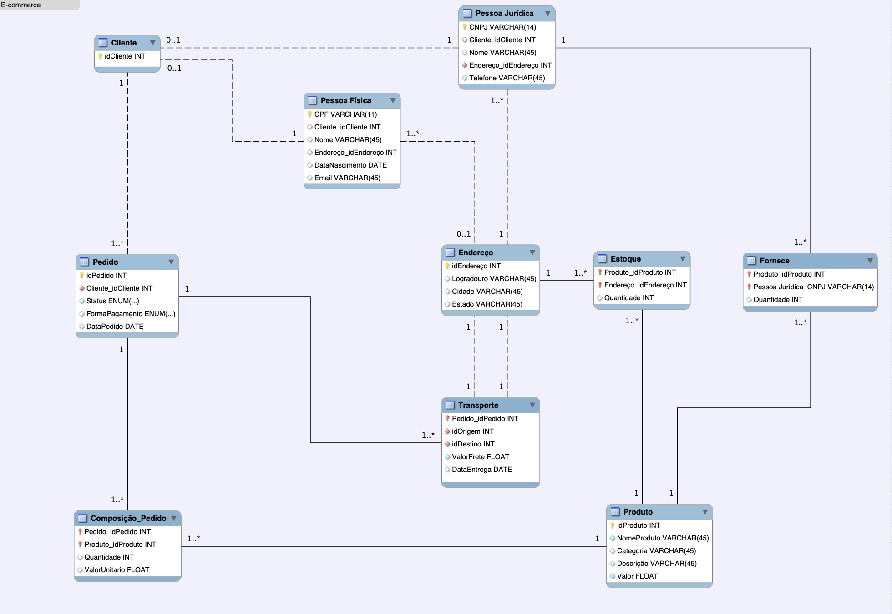

# Projeto de Banco de Dados de E-commerce (Conceitual e Lógico)

## Definição do escopo

A base de dados possui os seguintes elementos:

- Produto: Itens a serem comercializados.
- Estoque: Local e quantidade de cada item.
- Cliente: Quem fará a compra, pode ser uma pessoa física ou jurídica.
- Pedido: São criados pelos clientes. Pode possuir um ou mais produtos.
- Fornecedor: Origem dos produtos.


Para refinar o projeto foram criadas as seguintes estruturas:

- Pessoa Física
- Pessoa Jurídica
- Endereço

Um cliente é uma pessoa física ou uma pessoa jurídica.
Uma pessoa jurídica, pode ser um cliente, mas também pode um parceiro de vendas, fornecendo produtos.
Endereço agrupa as informações de localização de todas entidades. Um produto é estocado em um endereço. E um pedido possui endereços de origem e destino, que serão utilizados para o cálculo do frete.

O diagrama do projeto do banco de dados é apresentado a seguir:



## Projeto lógico

O segundo passo do projeto foi desenvolver o script de criação do banco de dados. 
Esse script está disponível no repositório.

```sql
SET @OLD_UNIQUE_CHECKS=@@UNIQUE_CHECKS, UNIQUE_CHECKS=0;
SET @OLD_FOREIGN_KEY_CHECKS=@@FOREIGN_KEY_CHECKS, FOREIGN_KEY_CHECKS=0;
SET @OLD_SQL_MODE=@@SQL_MODE, SQL_MODE='ONLY_FULL_GROUP_BY,STRICT_TRANS_TABLES,NO_ZERO_IN_DATE,NO_ZERO_DATE,ERROR_FOR_DIVISION_BY_ZERO,NO_ENGINE_SUBSTITUTION';

-- -----------------------------------------------------
-- Schema ecommerce
-- -----------------------------------------------------
CREATE SCHEMA IF NOT EXISTS `ecommerce` DEFAULT CHARACTER SET utf8 ;
USE `ecommerce` ;

-- -----------------------------------------------------
-- Table `ecommerce`.`Cliente`
-- -----------------------------------------------------
CREATE TABLE IF NOT EXISTS `ecommerce`.`Cliente` (
  `idCliente` INT NOT NULL AUTO_INCREMENT,
  PRIMARY KEY (`idCliente`),
  UNIQUE INDEX `idCliente_UNIQUE` (`idCliente` ASC) VISIBLE);


-- -----------------------------------------------------
-- Table `ecommerce`.`Endereço`
-- -----------------------------------------------------
CREATE TABLE IF NOT EXISTS `ecommerce`.`Endereço` (
  `idEndereço` INT NOT NULL AUTO_INCREMENT,
  `Logradouro` VARCHAR(45) NULL,
  `Cidade` VARCHAR(45) NULL,
  `Estado` VARCHAR(45) NULL,
  PRIMARY KEY (`idEndereço`),
  UNIQUE INDEX `idEndereço_UNIQUE` (`idEndereço` ASC) VISIBLE);


-- -----------------------------------------------------
-- Table `ecommerce`.`Pessoa Física`
-- -----------------------------------------------------
CREATE TABLE IF NOT EXISTS `ecommerce`.`Pessoa Física` (
  `CPF` VARCHAR(11) NOT NULL,
  `Cliente_idCliente` INT NULL,
  `Nome` VARCHAR(45) NULL,
  `Endereço_idEndereço` INT NULL,
  `DataNascimento` DATE NULL,
  `Email` VARCHAR(45) NULL,
  PRIMARY KEY (`CPF`),
  UNIQUE INDEX `CPF_UNIQUE` (`CPF` ASC) VISIBLE,
  UNIQUE INDEX `Cliente_idCliente_UNIQUE` (`Cliente_idCliente` ASC) VISIBLE,
  INDEX `fk_Pessoa Física_Endereço1_idx` (`Endereço_idEndereço` ASC) VISIBLE,
  CONSTRAINT `fk_Pessoa Física_Cliente1`
    FOREIGN KEY (`Cliente_idCliente`)
    REFERENCES `ecommerce`.`Cliente` (`idCliente`)
    ON DELETE CASCADE
    ON UPDATE NO ACTION,
  CONSTRAINT `fk_Pessoa Física_Endereço1`
    FOREIGN KEY (`Endereço_idEndereço`)
    REFERENCES `ecommerce`.`Endereço` (`idEndereço`)
    ON DELETE NO ACTION
    ON UPDATE NO ACTION);


-- -----------------------------------------------------
-- Table `ecommerce`.`Pessoa Jurídica`
-- -----------------------------------------------------
CREATE TABLE IF NOT EXISTS `ecommerce`.`Pessoa Jurídica` (
  `CNPJ` VARCHAR(14) NOT NULL,
  `Cliente_idCliente` INT NULL,
  `Nome` VARCHAR(45) NULL,
  `Endereço_idEndereço` INT NOT NULL,
  `Telefone` VARCHAR(45) NULL,
  PRIMARY KEY (`CNPJ`),
  INDEX `fk_Pessoa Jurídica_Cliente1_idx` (`Cliente_idCliente` ASC) VISIBLE,
  INDEX `fk_Pessoa Jurídica_Endereço1_idx` (`Endereço_idEndereço` ASC) VISIBLE,
  UNIQUE INDEX `Cliente_idCliente_UNIQUE` (`Cliente_idCliente` ASC) VISIBLE,
  CONSTRAINT `fk_Pessoa Jurídica_Cliente1`
    FOREIGN KEY (`Cliente_idCliente`)
    REFERENCES `ecommerce`.`Cliente` (`idCliente`)
    ON DELETE NO ACTION
    ON UPDATE NO ACTION,
  CONSTRAINT `fk_Pessoa Jurídica_Endereço1`
    FOREIGN KEY (`Endereço_idEndereço`)
    REFERENCES `ecommerce`.`Endereço` (`idEndereço`)
    ON DELETE NO ACTION
    ON UPDATE NO ACTION);


-- -----------------------------------------------------
-- Table `ecommerce`.`Produto`
-- -----------------------------------------------------
CREATE TABLE IF NOT EXISTS `ecommerce`.`Produto` (
  `idProduto` INT NOT NULL AUTO_INCREMENT,
  `NomeProduto` VARCHAR(45) NOT NULL,
  `Categoria` VARCHAR(45) NULL,
  `Descrição` VARCHAR(45) NULL,
  `Valor` FLOAT NOT NULL,
  PRIMARY KEY (`idProduto`),
  UNIQUE INDEX `idProduto_UNIQUE` (`idProduto` ASC) VISIBLE);


-- -----------------------------------------------------
-- Table `ecommerce`.`Pedido`
-- -----------------------------------------------------
CREATE TABLE IF NOT EXISTS `ecommerce`.`Pedido` (
  `idPedido` INT NOT NULL AUTO_INCREMENT,
  `Cliente_idCliente` INT NOT NULL,
  `Status` ENUM("Processando", "Enviado", "Entregue", "Cancelado") DEFAULT 'Processando',
  `FormaPagamento` ENUM("Boleto", "Cartão de Crédito", "PIX") DEFAULT 'Boleto',
  `DataPedido` DATE NULL,
  PRIMARY KEY (`idPedido`),
  UNIQUE INDEX `idPedido_UNIQUE` (`idPedido` ASC) VISIBLE,
  INDEX `fk_Pedido_Cliente1_idx` (`Cliente_idCliente` ASC) VISIBLE,
  CONSTRAINT `fk_Pedido_Cliente1`
    FOREIGN KEY (`Cliente_idCliente`)
    REFERENCES `ecommerce`.`Cliente` (`idCliente`)
    ON DELETE NO ACTION
    ON UPDATE NO ACTION);


-- -----------------------------------------------------
-- Table `ecommerce`.`Fornece`
-- -----------------------------------------------------
CREATE TABLE IF NOT EXISTS `ecommerce`.`Fornece` (
  `Produto_idProduto` INT NOT NULL,
  `Pessoa Jurídica_CNPJ` VARCHAR(14) NOT NULL,
  `Quantidade` INT NULL,
  PRIMARY KEY (`Produto_idProduto`, `Pessoa Jurídica_CNPJ`),
  INDEX `fk_Produto_has_Pessoa Jurídica1_Pessoa Jurídica1_idx` (`Pessoa Jurídica_CNPJ` ASC) VISIBLE,
  INDEX `fk_Produto_has_Pessoa Jurídica1_Produto1_idx` (`Produto_idProduto` ASC) VISIBLE,
  CONSTRAINT `fk_Produto_has_Pessoa Jurídica1_Produto1`
    FOREIGN KEY (`Produto_idProduto`)
    REFERENCES `ecommerce`.`Produto` (`idProduto`)
    ON DELETE NO ACTION
    ON UPDATE NO ACTION,
  CONSTRAINT `fk_Produto_has_Pessoa Jurídica1_Pessoa Jurídica1`
    FOREIGN KEY (`Pessoa Jurídica_CNPJ`)
    REFERENCES `ecommerce`.`Pessoa Jurídica` (`CNPJ`)
    ON DELETE NO ACTION
    ON UPDATE NO ACTION);


-- -----------------------------------------------------
-- Table `ecommerce`.`Composição_Pedido`
-- -----------------------------------------------------
CREATE TABLE IF NOT EXISTS `ecommerce`.`Composição_Pedido` (
  `Pedido_idPedido` INT NOT NULL,
  `Produto_idProduto` INT NOT NULL,
  `Quantidade` INT NULL,
  `ValorUnitario` FLOAT,
  PRIMARY KEY (`Pedido_idPedido`, `Produto_idProduto`),
  INDEX `fk_Pedido_has_Produto_Produto1_idx` (`Produto_idProduto` ASC) VISIBLE,
  INDEX `fk_Pedido_has_Produto_Pedido1_idx` (`Pedido_idPedido` ASC) VISIBLE,
  CONSTRAINT `fk_Pedido_has_Produto_Pedido1`
    FOREIGN KEY (`Pedido_idPedido`)
    REFERENCES `ecommerce`.`Pedido` (`idPedido`)
    ON DELETE NO ACTION
    ON UPDATE NO ACTION,
  CONSTRAINT `fk_Pedido_has_Produto_Produto1`
    FOREIGN KEY (`Produto_idProduto`)
    REFERENCES `ecommerce`.`Produto` (`idProduto`)
    ON DELETE NO ACTION
    ON UPDATE NO ACTION);


-- -----------------------------------------------------
-- Table `ecommerce`.`Estoque`
-- -----------------------------------------------------
CREATE TABLE IF NOT EXISTS `ecommerce`.`Estoque` (
  `Produto_idProduto` INT NOT NULL,
  `Endereço_idEndereço` INT NOT NULL,
  `Quantidade` INT NULL,
  PRIMARY KEY (`Produto_idProduto`, `Endereço_idEndereço`),
  INDEX `fk_Produto_has_Endereço_Endereço1_idx` (`Endereço_idEndereço` ASC) VISIBLE,
  INDEX `fk_Produto_has_Endereço_Produto1_idx` (`Produto_idProduto` ASC) VISIBLE,
  CONSTRAINT `fk_Produto_has_Endereço_Produto1`
    FOREIGN KEY (`Produto_idProduto`)
    REFERENCES `ecommerce`.`Produto` (`idProduto`)
    ON DELETE NO ACTION
    ON UPDATE NO ACTION,
  CONSTRAINT `fk_Produto_has_Endereço_Endereço1`
    FOREIGN KEY (`Endereço_idEndereço`)
    REFERENCES `ecommerce`.`Endereço` (`idEndereço`)
    ON DELETE NO ACTION
    ON UPDATE NO ACTION);


-- -----------------------------------------------------
-- Table `ecommerce`.`Transporte`
-- -----------------------------------------------------
CREATE TABLE IF NOT EXISTS `ecommerce`.`Transporte` (
  `Pedido_idPedido` INT NOT NULL,
  `idOrigem` INT NOT NULL,
  `idDestino` INT NOT NULL,
  `ValorFrete` FLOAT,
  `DataEntrega` DATE NULL,
  PRIMARY KEY (`Pedido_idPedido`),
  INDEX `fk_Pedido_has_Endereço_Pedido1_idx` (`Pedido_idPedido` ASC) VISIBLE,
  INDEX `fk_Transportado_Endereço1_idx` (`idDestino` ASC) VISIBLE,
  INDEX `fk_Transportado_Endereço2_idx` (`idOrigem` ASC) VISIBLE,
  CONSTRAINT `fk_Pedido_has_Endereço_Pedido1`
    FOREIGN KEY (`Pedido_idPedido`)
    REFERENCES `ecommerce`.`Pedido` (`idPedido`)
    ON DELETE NO ACTION
    ON UPDATE NO ACTION,
  CONSTRAINT `fk_Transportado_Endereço1`
    FOREIGN KEY (`idDestino`)
    REFERENCES `ecommerce`.`Endereço` (`idEndereço`)
    ON DELETE NO ACTION
    ON UPDATE NO ACTION,
  CONSTRAINT `fk_Transportado_Endereço2`
    FOREIGN KEY (`idOrigem`)
    REFERENCES `ecommerce`.`Endereço` (`idEndereço`)
    ON DELETE NO ACTION
    ON UPDATE NO ACTION);


SET SQL_MODE=@OLD_SQL_MODE;
SET FOREIGN_KEY_CHECKS=@OLD_FOREIGN_KEY_CHECKS;
SET UNIQUE_CHECKS=@OLD_UNIQUE_CHECKS;
```