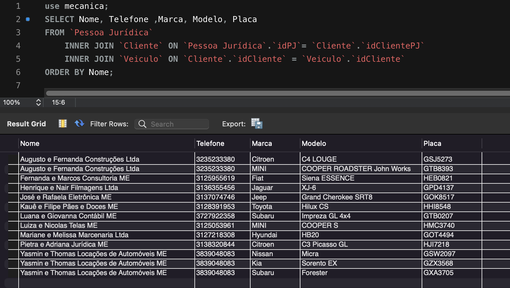

# Projeto de Banco de Dados de E-commerce

## Projeto Conceitual

Modelagem de um banco de dados para uma oficina mecânica.

- A oficina possui pessoas físicas e jurídicas como clientes, que podem possuir diversos veículos.

- Ao dar entrada com o veículo para a realização de um serviço é gerada uma ordem de serviço.

- Essa ordem incluirá os valores materiais e mão de obra utilizados, que deve ser aprovada pelo cliente para a execução do serviço por um funcionário.

Sendo assim, projetou-se o seguinte diagrama:

## Projeto lógico

Em seguida, gerou-se um script para a criação do banco de dados. Ele está disponível no repositório como `create_db.sql`.

### Insersção de dados para teste

Além disso criou-se um conjunto de dados sintéticos para testar a criação do banco. Esse script de inserção de dados está presente na pasta dados.

Para exemplificar, segue uma query unindo as tabelas Pessoa Juridica, Cliente e Veículo com objetivo de listar o nome e contato das empresas e os respectivos veículos cadastrados na oficina. 

